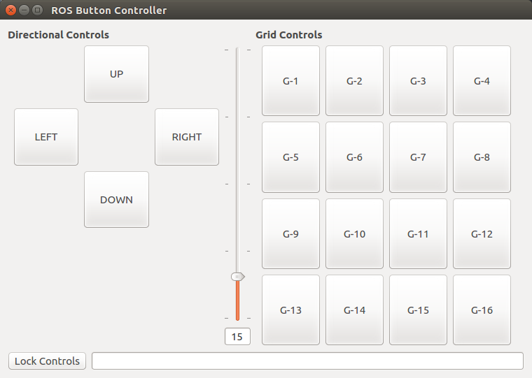

# UML ROS QT GUI
This repository contains various ROS packages that are examples of functional GUIs with the capability of communicating via ROS topics. These GUIs are written using QT, and the file structure for each package is based on the template GUI package created by [qt_create](http://wiki.ros.org/qt_create?distro=kinetic) (via *catkin_create_qt_pkg* command). The goal of this repository is to make customizable ROS GUI packages available which may be useful as they are, while also providing adequate documentation for how to implement the various features they contain. The combination of examples and documentation should enable someone who is needing a particular ROS GUI to make one by adapting the relevant pieces of example code in a relatively short time frame.  

**Quick Resources**  
[QT Open Source Download](https://www.qt.io/download-qt-installer)  
[QT Overview (Especially Core Internals)](https://doc.qt.io/qt-5/overviews-main.html)  
[QT Reference](https://doc.qt.io/qt-5/reference-overview.html)  
[QT Examples And Tutorials](https://doc.qt.io/qt-5/qtexamplesandtutorials.html)  

## Setup  
Install all of the ROS QT packages, which likely includes some that are unnecessary, but enough of them are needed to justify doing it this way for the sake of simplicity:

> sudo apt-get install ros-kinetic-qt-*  

Then, clone this repository to your ROS workspace src folder and build the packages within.  

## Packages
### text_display  
  
> roslaunch text_display text_display.launch   

**Function:**  
The text_display packages is a very simple type of GUI, it's only function is to listen on a given ROS topic for a message string, and then displays any messages it receives (centered in the window and with the desired font size). Text_display has a setting named *fancy_draw* which, if enabled, will animate the messages being displayed. If fancy_draw is disabled, messages will appear immediately. **TIP:** You can use ` ` within your messages to act as a newline character.  

**Use Cases:**  
This package may be useful for HRI studies where you need to display text to a participant based on what the robot is doing.  
More generally, it might be useful for displaying a robots internal status and debugging.  

**Demonstrates:**  
* How to implement a ROS Subscriber into a GUI  
* How to set and receive parameters from a .launch file as well as .yaml files  
* How to programmatically set Window properties like position, size, colors, and font size  
* How to use QTime to implement a simple delay function  

### button_controller  
  
> roslaunch button_controller button_controller.launch   

**Function:**  
The button_controller package serves as a ROS publisher, for which a node can be written to interpret the messages being sent in any kind of situation where communicating to ROS via buttons is needed. The Directional and Grid controls function slightly differently. For the Directionals, when held down they will continually publish messages. Grid controls will not do this, and will publish a single message when the button is released.   
*NOTE:* The Directional controls can be activated using WASD/Arrow Keys. WASD tends to be more responsive because depending on which UI element is in focus, it might "consume" the keyPressEvent of the arrow keys (clicking on the background of the window should allow them to work properly).   

Additionally, the value of the vertical slider (0-100) is appended to every message sent, separated from the button identifier by a semi-colon. This value can be parsed and used as a modifier or simply ignored by the interpreter node.  

**Use Cases:**   
Between the directional and grid controls, this GUI could be used almost any time buttons of some kind would be convenient. If needed, the text displayed on the buttons can be changed to make operation easier. With the *send_button_names* parameter enabled, it will send the text of the button as it's ROS message, which may be helpful or make parsing messages more tedious depending on the application. Disabling *send_button_names* will instead send generic button identifiers (i.e. - D1-D4, G1-G16) which can simplify message interpretation.  

**Demonstrates:**  
* How to implement a ROS Publisher into a GUI  
* How to implement keyPressEvents for keyboard control
* How to enable and disable UI elements
* How to set and receive parameters from a .launch file as well as .yaml files  
* How to programmatically set Window properties like position and size   

### blank_slate  
> rosrun blank_slate_gui blank_slate  

**Function:**  
Literally none.

**Purpose:**
The blank_slate package has all the structural code in place to implement a GUI without defining any specific SIGNALS or SLOTS. This means that a designed UI can be pasted into this package and build without error. This should make creating new ROS GUI packages fairly quick and painless.  

**To Create a new ROS GUI package:**  
1. Design your desired GUI using QT Creator, then build the project which will generate a .ui file for you.  
  *NOTE:* If you replace the contents of blank_slates .ui with your .ui file now, it should build and run just fine,
          but if you intend to add your GUI package to the repository it's best to copy the blank_slate package first
          in order to make a new package.
1. Make a copy of the blank_slate package and make the following changes (using the name of your new package):  
    * Rename the folder
    * Change package <name> tag within package.xml
    * Replace 'blank_slate' within the project(), add_executable(), target_link_libraries(), and install() properties of your CMakeLists.txt
    * Within your the header and cpp files, change the namespaces and preprocessor directives to reflect your new package (If I count correctly you should need to make a total of 9 changes)
1. Open the .ui file in your new package and replace it's contents with your generated .ui file.  
1. Build your workspace/package.
1. You should now have a ROS GUI package that will display without any functionality. The rest of the packages in this repository serve as examples of how to implement certain features you may need.     
