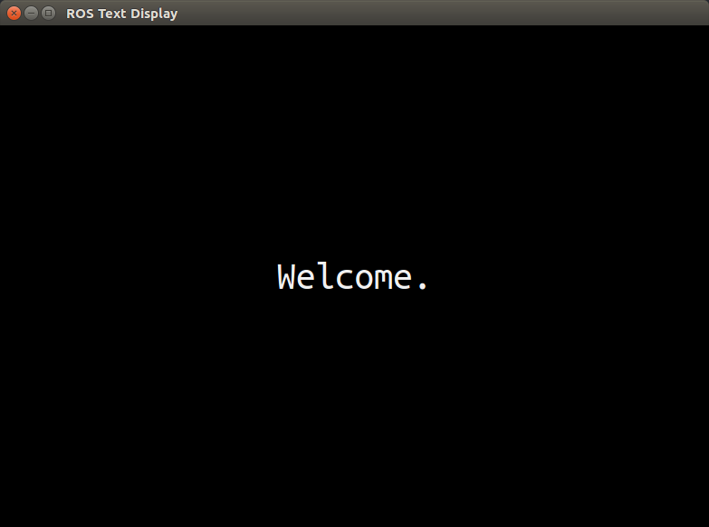

# UML ROS GUI
This repository contains various ROS packages that are examples of functional GUIs with the capability of communicating via ROS topics. These GUIs are written using QT, and the file structure for each package is based on the template GUI package created by [qt_create](http://wiki.ros.org/qt_create?distro=kinetic) (via *catkin_create_qt_pkg* command). The goal of this repository is to make customizable ROS GUI packages available which may be useful as they are, while also providing adequate documentation for how to implement the various features they contain. The combination of examples and documentation should enable someone who is needing a particular ROS GUI to make one by adapting the relevant pieces of example code in a relatively short time frame.  

**Quick Resources**  
[QT Open Source Download](https://www.qt.io/download-qt-installer)  
[QT Overview (Especially Core Internals)](https://doc.qt.io/qt-5/overviews-main.html)  
[Qt Reference](https://doc.qt.io/qt-5/reference-overview.html)  
[Qt Examples And Tutorials](https://doc.qt.io/qt-5/qtexamplesandtutorials.html)  

### Setup  
Install all of the ROS QT packages, which likely includes some that are unnecessary, but enough of them are needed to justify doing it this way for the sake of simplicity:

> sudo apt-get install ros-kinetic-qt-*  

### Packages
#### text_display  
  
**Function:**  
The text_display packages is a very simple type of GUI, it's only function is to listen on a given ROS topic for a message string, and then displays any messages it receives (centered in the window and with the desired font size). Text_display has a setting named *fancy_draw* which, if enabled, will animate the messages being displayed. If fancy_draw is disabled, messages will appear immediately.

**Use Cases:**  
This package may be useful for HRI studies where you need to display text to a participant based on what the robot is doing.
More generally, it might be useful for displaying a robots internal status and debugging.  

**Demonstrates:**  
* How to implement a ROS Subscriber  
* How to set and receive parameters from a .launch file as well as .yaml files  
* How to programmatically set Window properties like position, size, colors, and font size  
